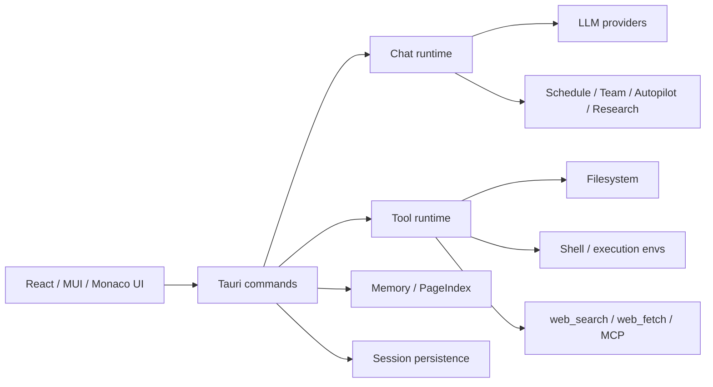

# Omiga

Omiga 是一个基于 **Tauri + React + Rust** 的桌面 AI Coding Agent 工作台。它把聊天、代码上下文、文件操作、工具调用、记忆系统和多 Agent 编排放在同一个本地桌面应用里，目标是成为一个可审计、可扩展、面向真实开发工作的 Agent IDE。

> 当前版本：`0.2.0`。项目正处于第一版发布前的硬化阶段：核心前端、Tauri 后端、LLM 配置、工具调用、文件树操作、长会话渲染和 mock/real LLM 验证路径已具备基础自动化覆盖；打包发布、签名、公证、GUI E2E 和安全策略仍在持续完善。

## 目录

- [核心能力](#核心能力)
- [快速开始](#快速开始)
- [配置真实 LLM](#配置真实-llm)
- [常用命令](#常用命令)
- [测试与验证](#测试与验证)
- [架构概览](#架构概览)
- [Research System](#research-system)
- [记忆系统](#记忆系统)
- [安全与隐私](#安全与隐私)
- [发布前检查清单](#发布前检查清单)
- [项目结构](#项目结构)

## 核心能力

- **桌面 AI 编程工作台**：Tauri 原生壳 + React 前端，适合长时间本地开发会话。
- **多 Provider LLM**：通过 `omiga.yaml` 支持 DeepSeek、OpenAI/OpenAI-compatible、自定义 endpoint 等配置。
- **工具调用与流式状态**：支持 shell、文件读写、搜索、网页检索、MCP/Agent-browser fallback 等工具调用，并在聊天 UI 中展示执行步骤。
- **Agent 编排**：支持 `/schedule`、`/team`、`/autopilot`、`/research` 等编排入口，包含 mock 离线验证和 real LLM 手动验收路径。
- **本地文件体验**：文件树、目录列表、文件创建/重命名/删除、Monaco 编辑器、PDF/图片/HTML 本地预览。
- **记忆与知识库**：项目级 wiki、implicit memory、working memory、long-term/permanent profile，用于跨会话上下文恢复。
- **性能硬化**：长聊天渐进渲染、工具折叠、Monaco/PDF/Plotly/ECharts 等大依赖 chunk 拆分，配套渲染基准测试。
- **发布前可验证性**：前端 Vitest、Rust 单元/集成测试、mock LLM orchestration harness、real LLM ignored tests 和 CI 基础流水线。

## 快速开始

### 前置要求

- Node.js 20+
- Rust 1.75+
- npm
- 系统侧 Tauri 依赖（Linux 需要 WebKit/GTK 相关包；macOS/Windows 按 Tauri 2 默认环境准备）

### 安装依赖

```bash
npm ci
```

### 启动前端开发服务

```bash
npm run dev
```

### 启动 Tauri 桌面应用

```bash
npm run tauri -- dev
```

### 构建前端

```bash
npm run build
```

### 构建桌面安装包/应用包

```bash
npm run tauri -- build
```

## 配置真实 LLM

Omiga 运行时会通过 `omiga_lib::llm::load_config()` 查找 LLM 配置。推荐从模板开始：

```bash
cp config.example.yaml omiga.yaml
```

常用配置示例：

```yaml
version: "1.0"
default: "deepseek"

providers:
  deepseek:
    type: deepseek
    api_key: ${DEEPSEEK_API_KEY}
    model: deepseek-chat
    enabled: true

  custom:
    type: custom
    api_key: ${LLM_API_KEY}
    base_url: ${LLM_BASE_URL}
    model: ${LLM_MODEL}
    enabled: false

settings:
  max_tokens: 4096
  temperature: 0.7
  timeout: 600
  enable_tools: true
```

配置查找顺序包括：

1. 项目根目录：`omiga.yaml` / `omiga.yml` / `omiga.json` / `omiga.toml`
2. 从 `src-tauri` 运行时的父项目根目录
3. 用户配置目录：`~/.config/omiga/omiga.yaml` 等
4. Legacy Omiga home：`~/.omiga/omiga.yaml` 等

也支持简单 dotenv 风格文件，例如 `~/.omiga/omiga.yaml`：

```bash
DEEPSEEK_API_KEY=sk-...
DEEPSEEK_MODEL=deepseek-chat
```

不要提交真实 API key。更多 real LLM 验证说明见 [`docs/REAL_LLM_VALIDATION.md`](docs/REAL_LLM_VALIDATION.md)。

## 常用命令

| 目标 | 命令 |
| --- | --- |
| 安装依赖 | `npm ci` |
| 前端开发 | `npm run dev` |
| Tauri 开发 | `npm run tauri -- dev` |
| 前端测试 | `npm test` |
| 前端构建 | `npm run build` |
| Rust 测试 | `cargo test --manifest-path src-tauri/Cargo.toml` |
| Rust 格式化检查 | `cargo fmt --manifest-path src-tauri/Cargo.toml --all -- --check` |
| Rust lint | `cargo clippy --manifest-path src-tauri/Cargo.toml --all-targets` |
| Mock LLM 验证 | `./scripts/mock-llm-validation.sh all` |
| Real LLM 验证 | `./scripts/real-llm-validation.sh all` |
| Tauri 打包 | `npm run tauri -- build` |

## 测试与验证

### 默认离线路径

默认测试不依赖真实 API key：

```bash
npm test
cargo test --manifest-path src-tauri/Cargo.toml
```

`cargo test` 包含 deterministic mock LLM orchestration harness，用于验证 `/schedule`、`/team`、`/autopilot` 等编排路径的核心结构。

### Real LLM 手动验收

真实 provider 验证默认被 `#[ignore]` 跳过，因为它依赖网络、密钥、账单和 provider 可用性。配置好 LLM 后运行：

```bash
./scripts/real-llm-validation.sh smoke
./scripts/real-llm-validation.sh schedule
./scripts/real-llm-validation.sh team
./scripts/real-llm-validation.sh autopilot
./scripts/real-llm-validation.sh all
```

### 性能回归

前端包含长会话渲染基准和渐进渲染工具测试：

```bash
npm test -- src/components/Chat/chatRenderBenchmark.test.tsx
npm test -- src/components/Chat/renderPerfUtils.test.ts src/components/Chat/renderItemUtils.test.ts
```

构建输出中的大 chunk 主要来自 Monaco、Plotly、ECharts、PDF worker、TypeScript worker 等桌面 IDE/可视化依赖。它们已拆分为 vendor chunks，后续仍会继续推进更细粒度按需加载。

## 架构概览



核心分层：

- **Frontend**：聊天、文件树、设置、执行进度、Agent 状态、可视化组件。
- **Tauri Commands**：前端 IPC 边界，负责会话、文件、设置、工具和 Agent 编排入口。
- **Domain**：LLM、工具、Agent scheduler、Research System、memory、permissions、runtime constraints。
- **Persistence**：会话、消息、orchestration events、memory index、research artifacts/evidence/traces。
- **Execution**：local/docker/ssh/modal/daytona/singularity 等执行环境抽象。

更多设计文档见 [`docs/architecture.md`](docs/architecture.md)。

## Research System

Omiga 内置一套 Rust 实现的分层 Research System，位于 [`src-tauri/src/domain/research_system`](src-tauri/src/domain/research_system)。它提供：

- `Intake`：理解用户请求、记录 assumptions/ambiguities。
- `Planner`：生成带 success criteria、verification、budget 的 `TaskGraph`。
- `Executor / Supervisor`：按依赖调度任务，调用 specialist agent。
- `Reviewer`：检查输出、证据、权限状态和成功标准覆盖。
- `Creator`：根据 traces 生成 agent capability refactor proposal。

聊天中可使用：

```text
/research init
/research list-agents
/research list-proposals
/research plan <request>
/research run <request>
/research review-traces
/research approve-proposal <proposal-id>
```

Research System 当前仍以 deterministic heuristic planner 和 mock runner 为默认安全路径；provider-backed planner 和更完整的 GUI 接线会持续演进。

## 记忆系统

Omiga 内置多层记忆架构，让 Agent 能够在会话内和跨会话之间积累、检索和管理知识。

### 五层记忆架构

| 层级 | 存储位置 | 生命周期 | 用途 |
|------|---------|---------|------|
| **工作记忆 (Working Memory)** | SQLite（当前会话） | 会话内有效 | 任务上下文、当前活动主题、待办事项、关键决策 |
| **长期记忆 (Long-Term Memory)** | `long_term/*.json` | 持久，带 TTL | 研究洞察、规则偏好、会话摘要、来源引用 |
| **Wiki 知识库** | `.omiga/memory/wiki/` | 持久 | TF-IDF 全文索引的结构化项目知识 |
| **隐性记忆 (Implicit Memory)** | `.omiga/memory/implicit/` | 持久 | 观察到的用户偏好和行为模式 |
| **永久档案 (Permanent Profile)** | `~/.omiga/memory/permanent/` | 永久 | 跨项目用户配置文件 |

### Hot / Warm / Cold 三级召回

- **Hot（始终注入）**：工作记忆摘要 + Dossier 项目简报 + Permanent Profile，每次请求都添加到系统提示。
- **Warm（按需检索）**：长期记忆 + Wiki 知识库，在每次 LLM 调用前通过两阶段召回检索 Top-K 相关条目。
- **Cold（显式触发）**：隐性记忆 + 聊天历史，仅在 `/memory recall scope=implicit` 等显式调用时检索。

### 两阶段召回（Two-Phase Recall）

1. **Phase 1**：检索 `limit × 3`（最少 12）个候选条目，按 TF-IDF 质量评分排序。
2. **Phase 2**：结合当前会话上下文对候选进行重排，最终分数 = 70% 原始质量分 + 30% 上下文重叠分。

### 预飞缓存（Preflight Cache）

记忆上下文检索结果在 Session 级别缓存 60 秒，避免每轮 LLM 调用重复扫描磁盘。缓存 key = `{session_id}:{query_prefix_16}`。

### Dossier（项目简报）

每次会话摘要或任务完成时自动更新的项目级知识对象，包含：
- `title`：项目标题
- `brief`：项目描述
- `current_beliefs`：当前核心观点列表（去重，上限 10 条）
- `decisions`：已做的关键决策（上限 10 条）
- `open_questions`：待解决的问题（上限 8 条）
- `next_steps`：后续行动项（最新替换）

Dossier 以 Permanent RetentionClass 保存，并作为 Hot Memory 的一部分注入每次请求的系统提示。

### 来源注册表（Source Registry）

每次 `web_fetch` / `web_search` 后，自动把访问的 URL 写入来源注册表（`long_term/sources/`）。  
再次访问相同 URL（按规范化 canonical URL 去重）时，命中缓存 gist 可直接注入工具输出，节省 token。

### Write Gate（写入门控）

防止长期记忆无限膨胀：

- **全局软上限**：500 个条目。超出时按质量分（confidence × stability × reuse_probability）淘汰最低分条目。
- **主题家族上限**：同一 topic slug 前缀族群最多 5 个条目，超出则淘汰。
- **过期清理**：TTL 到期的条目通过 `prune_stale_entries` 软删除（标记为 Archived）或硬删除。

### RetentionClass 与 EntryStatus

```text
RetentionClass:  Permanent | LongTerm | Session | Ephemeral
EntryStatus:     Active | Archived | Superseded
```

搜索时自动跳过非 Active 和已过期条目。

### Research → 记忆集成

`/research run <topic>` 成功完成后，自动将研究目标和结论写入 `ResearchInsight` 类型的长期记忆条目（fire-and-forget，不阻塞响应）。

### 记忆管理 UI

在 **设置 → 记忆** 面板中可以：

- **概览**：查看各层记忆条目数、来源引用数、记忆健康状态
- **长期记忆**：按类型浏览所有条目，支持归档（Archive）、删除（Delete）、批量清理过期条目（Prune Stale）
- **隐性记忆**：查看和管理观察到的行为偏好
- **Wiki**：浏览项目知识库文章

### 可用 Tauri 命令（记忆相关）

| 命令 | 说明 |
|------|------|
| `memory_list_long_term` | 列出长期记忆条目（按 scope 过滤） |
| `memory_archive_long_term_entry` | 归档指定条目（软删除） |
| `memory_delete_long_term_entry` | 永久删除指定条目 |
| `memory_prune_stale` | 清理所有过期和 Archived 条目 |
| `get_memory_context` | 获取当前会话的记忆上下文（供系统提示注入） |
| `get_memory_stats` | 获取各层记忆统计信息 |

### 存储路径

```text
<project-root>/
└── .omiga/memory/
    ├── long_term/           # 长期记忆 JSON 文件（含 dossier_*.json 和 sources/）
    ├── wiki/                # PageIndex 构建的 Wiki 文章
    └── implicit/            # 隐性记忆文件

~/.omiga/memory/
└── permanent/wiki/          # 跨项目永久知识库
```

## 安全与隐私

- Omiga 默认是本地桌面应用；会话、memory、research artifacts 等数据主要保存在本机。
- 真实 LLM 调用会把必要的消息、上下文和工具结果发送给你配置的 provider；请根据 provider 的隐私策略选择模型。
- 不要把真实 API key 提交进仓库；推荐使用环境变量或用户级私有配置文件。
- 文件系统、shell、web、MCP 等工具是高风险边界，第一版发布前需要持续强化审批、路径边界、审计和错误可见性。
- 当前 Tauri CSP、打包签名、公证、GUI E2E 和更完整的审计日志仍属于发布前重点工作。

## 发布前检查清单

第一版发布前建议至少完成：

- [ ] 工作区干净，版本号、changelog、release notes 对齐。
- [ ] `npm test`、`npm run build`、`cargo test --manifest-path src-tauri/Cargo.toml` 通过。
- [ ] `cargo fmt --manifest-path src-tauri/Cargo.toml --all -- --check` 通过。
- [ ] `cargo clippy --manifest-path src-tauri/Cargo.toml --all-targets` warning debt 已评估或清零。
- [ ] `./scripts/mock-llm-validation.sh all` 通过。
- [ ] 至少一次 real LLM `smoke` + 关键编排路径验收通过。
- [ ] `npm run tauri -- build` 在目标平台通过。
- [ ] 打包后的桌面应用完成 GUI smoke：新建会话、发送消息、取消、文件树操作、设置 provider、长会话滚动。
- [ ] CSP、权限说明、隐私说明、错误诊断导出和已知限制更新。

## 项目结构

```text
.
├── src/                         # React frontend
│   ├── components/              # Chat, settings, file tree, task status, visualizations
│   ├── state/                   # Zustand stores and session/activity state
│   ├── hooks/                   # UI/runtime hooks
│   ├── lib/                     # Monaco/PDF workers, helpers
│   └── utils/                   # frontend utility functions and tests
├── src-tauri/                   # Rust/Tauri backend
│   ├── src/commands/            # Tauri IPC commands
│   ├── src/domain/              # tools, agents, memory, research, permissions
│   ├── src/execution/           # execution environment adapters
│   ├── src/llm/                 # provider clients and config loader
│   └── tests/                   # Rust integration tests
├── docs/                        # architecture, validation and implementation notes
├── scripts/                     # validation/dev helper scripts
├── config.example.yaml          # LLM config template
├── package.json                 # frontend scripts/dependencies
└── vite.config.ts               # Vite build/chunk configuration
```

## 相关文档

- [`docs/REAL_LLM_VALIDATION.md`](docs/REAL_LLM_VALIDATION.md)
- [`docs/MOCK_LLM_RUNTIME_VALIDATION.md`](docs/MOCK_LLM_RUNTIME_VALIDATION.md)
- [`docs/architecture.md`](docs/architecture.md)
- [`docs/agent-card-spec.md`](docs/agent-card-spec.md)
- [`docs/SECURITY_MODEL.md`](docs/SECURITY_MODEL.md)
- [`docs/OMIGA_ENHANCEMENT_PLAN.md`](docs/OMIGA_ENHANCEMENT_PLAN.md)
