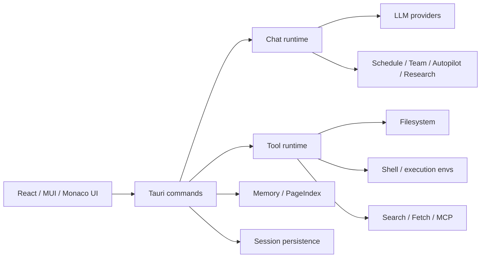

# Omiga

[English](README.md) | [简体中文](README.zh-CN.md)

Omiga is a local-first desktop AI coding agent workbench built with **Tauri, React, and Rust**. It combines chat, repository context, file operations, terminal execution, web/search tools, memory, and multi-agent orchestration in one auditable desktop application.

**Current release:** `2.0.0`

Omiga is designed for real development work: long-running coding sessions, codebase navigation, controlled tool execution, persistent project memory, and agent workflows that can be inspected rather than treated as a black box.

## Table of contents

- [What Omiga provides](#what-omiga-provides)
- [Release highlights](#release-highlights)
- [System requirements](#system-requirements)
- [Quick start](#quick-start)
- [LLM configuration](#llm-configuration)
- [Search and web access](#search-and-web-access)
- [Common commands](#common-commands)
- [Validation before release](#validation-before-release)
- [Architecture](#architecture)
- [Memory system](#memory-system)
- [Security and privacy](#security-and-privacy)
- [Project structure](#project-structure)
- [License](#license)
- [Further documentation](#further-documentation)

## What Omiga provides

- **Desktop AI coding workspace** — a Tauri desktop shell with a React/MUI interface for long-form engineering sessions.
- **Provider-based LLM runtime** — DeepSeek, OpenAI, OpenAI-compatible/custom endpoints, and configurable models through `omiga.yaml` or the Settings UI.
- **Auditable tool execution** — file read/write, search, fetch, shell, task, notebook, memory, MCP, and workflow tools with visible execution state. Sensitive tool executions are recorded to a local audit log (`~/.omiga/audit/`).
- **Multi-agent workflows** — scheduling, team/autopilot-style orchestration, background agents, research flows, and task status panels. Skills support forked sub-agent execution and per-skill tool allowlists.
- **Repository-aware context** — file tree, path mentions, code previews, Monaco editor integration, PDF/image/HTML rendering, and workspace metadata. Git worktree isolation (`EnterWorktree` / `ExitWorktree`) for branch-scoped sessions.
- **Search and retrieval** — configurable search priority with Tavily, Exa, Firecrawl, Parallel, Google, Bing, and DuckDuckGo fallbacks; literature and social-source search surfaces are available in the Search settings area.
- **Persistent memory** — working memory, long-term memory, project wiki, implicit preferences, source registry, and permanent user profile support with keyword-based PageIndex retrieval.
- **Operator system** — install plugin-provided operators as agent tools; create user-defined script operators directly from the Settings UI without writing YAML by hand.
- **Local IPC bridge** — a JWT-authenticated WebSocket endpoint on `localhost:7777` lets local tools (Raycast, Alfred, shell scripts) inject code context into Omiga sessions.
- **Execution environments** — local execution plus SSH/sandbox-oriented configuration surfaces for safer and more reproducible agent runs.
- **Release-grade validation paths** — 307 frontend unit tests, 844 Rust tests, 10 Playwright E2E tests, mock LLM orchestration validation, real LLM validation scripts, and desktop packaging commands.

## Release highlights

Version `2.0.0` builds on the v1.0.0 workbench foundation with quality, memory, and scheduling improvements:

- **BM25 field-weighted memory recall** — topic/entity/summary fields scored with per-field weights (3×/2×/1.5×) plus recency decay; recall precision improves substantially for structured queries.
- **Cron scheduling tools** — `CronCreate`, `CronList`, `CronDelete` let agents schedule recurring tasks; a dedicated **Settings → Agents → Schedule** panel shows all active jobs with one-click delete.
- **Session artifact tracking** — every file the agent writes or edits during a session is recorded and displayed in the task panel after the turn completes.
- **Task progress visualization** — `TaskProgressSteps` component shows a live step-by-step tool trace with status dots and durations; collapses to a summary when the turn ends.
- **Permission dialog improvements** — dangerous operations now display a plain-language description (`"AI wants to run: rm -rf …"`) above the raw command block.
- **Sequential tool timeout** — non-skill/bash tools are capped at 120 s; `skill`, `bash`, and `agent` tools are exempt to support long-running sessions.
- **Monitor and PushNotification tools** — `Monitor` watches background task output for a pattern; `PushNotification` sends a native desktop notification.
- **Git worktree tools** — `EnterWorktree`/`ExitWorktree` create and prune isolated branch workspaces.
- **Session export** — export any session as a Markdown file via the session header menu.
- **Test coverage** — 844 Rust tests, 307 frontend unit tests.

## System requirements

- **Bun** 1.x (canonical JavaScript package manager for this repository)
- **Rust** 1.75+
- **Tauri 2** platform prerequisites for your OS
- **macOS 11+**, Windows, or Linux with the required WebKit/GTK packages for Tauri
- At least one supported LLM provider key or an OpenAI-compatible local endpoint for real agent runs

> Use Bun for dependency installation and project scripts. Do not use `npm install` for this repository.

## Quick start

```bash
# 1. Install JavaScript dependencies
bun install

# 2. Create a local runtime config
cp config.example.yaml omiga.yaml

# 3. Provide at least one real provider key, for example
export DEEPSEEK_API_KEY="sk-..."
# or
export OPENAI_API_KEY="sk-..."

# 4. Start the desktop app in development mode
bun run tauri dev
```

For frontend-only development:

```bash
bun run dev
```

Build the frontend:

```bash
bun run build
```

Build desktop bundles:

```bash
bun run tauri build
```

## LLM configuration

Start from the template:

```bash
cp config.example.yaml omiga.yaml
```

Example:

```yaml
version: "1.0"
default: "deepseek"

providers:
  deepseek:
    type: deepseek
    api_key: ${DEEPSEEK_API_KEY}
    model: deepseek-chat
    enabled: true

  openai:
    type: openai
    api_key: ${OPENAI_API_KEY}
    model: gpt-4o
    enabled: false

  custom:
    type: custom
    api_key: ${LLM_API_KEY}
    base_url: ${LLM_BASE_URL}
    model: ${LLM_MODEL}
    enabled: false

settings:
  max_tokens: 4096
  temperature: 0.7
  timeout: 600
  enable_tools: true
  web_use_proxy: true
  web_search_engine: ddg
  web_search_methods: [tavily, exa, firecrawl, parallel, google, bing, ddg]
```

Configuration lookup order:

1. Project root: `omiga.yaml`, `omiga.yml`, `omiga.json`, or `omiga.toml`
2. Parent project root when launched from `src-tauri`
3. User config directory: `~/.config/omiga/omiga.yaml` and related extensions
4. Legacy Omiga home: `~/.omiga/omiga.yaml` and related extensions

Never commit real API keys. Prefer environment variables or a private user-level config file.

## Search and web access

Omiga exposes search/fetch settings in **Settings → Search**.

The web search method list is ordered and configurable. At runtime Omiga tries the enabled methods in user-defined priority order. Each method is attempted up to three times; if it fails or returns no usable results, Omiga moves to the next method.

Supported web methods:

- Tavily
- Exa
- Firecrawl
- Parallel
- Google
- Bing
- DuckDuckGo

Additional search surfaces include literature-oriented sources such as PubMed/Semantic Scholar configuration and social-source options such as WeChat search, where available in the build.

Proxy behavior is also configured in **Settings → Search**. Keep it enabled when your environment requires system or environment proxy settings for web access; disable it to force direct connections.

## Common commands

| Goal | Command |
| --- | --- |
| Install dependencies | `bun install` |
| Frontend dev server | `bun run dev` |
| Tauri desktop dev app | `bun run tauri dev` |
| Frontend tests | `bun run test` |
| Frontend production build | `bun run build` |
| Desktop bundle build | `bun run tauri build` |
| Rust tests | `cargo test --manifest-path src-tauri/Cargo.toml` |
| Rust formatting check | `cargo fmt --manifest-path src-tauri/Cargo.toml --all -- --check` |
| Rust lint | `cargo clippy --manifest-path src-tauri/Cargo.toml --all-targets -- -D warnings` |
| Mock LLM validation | `./scripts/mock-llm-validation.sh all` |
| Real LLM validation | `./scripts/real-llm-validation.sh all` |

## Validation before release

Use this checklist before tagging or distributing a release build:

```bash
bun install
bun run test
bun run build
cargo fmt --manifest-path src-tauri/Cargo.toml --all -- --check
cargo clippy --manifest-path src-tauri/Cargo.toml --all-targets -- -D warnings
cargo test --manifest-path src-tauri/Cargo.toml
./scripts/mock-llm-validation.sh all
bun run tauri build
```

For provider-backed validation, configure real credentials and run:

```bash
./scripts/real-llm-validation.sh smoke
./scripts/real-llm-validation.sh all
```

Manual desktop smoke test:

1. Launch the packaged app.
2. Create or open a session.
3. Select a workspace.
4. Configure a provider and model.
5. Send a normal chat request.
6. Run a file/search/tool task.
7. Cancel a running task and verify UI recovery.
8. Confirm Settings pages persist provider, search, permission, memory, and execution options.
9. Verify logs/errors are visible enough to diagnose failures.

## Architecture



Main layers:

- **Frontend (`src/`)** — chat UI, settings, file tree, task status, renderers, visualizations, and state stores.
- **Tauri command boundary (`src-tauri/src/commands/`)** — IPC handlers for sessions, settings, tools, memory, and orchestration.
- **Domain runtime (`src-tauri/src/domain/`)** — tools, agents, memory, permissions, search, research system, routing, and runtime constraints.
- **LLM layer (`src-tauri/src/llm/`)** — provider config loading, model clients, streaming, and provider-specific behavior.
- **Persistence** — sessions, messages, orchestration events, memory entries, source registry, and research artifacts.

## Memory system

Omiga includes a multi-layer memory model:

| Layer | Purpose |
| --- | --- |
| Working memory | Current-session task context and active decisions |
| Long-term memory | Persistent insights, rules, summaries, and sourced facts |
| Project wiki | Structured project knowledge indexed for retrieval |
| Implicit memory | Observed user/project preferences |
| Permanent profile | Cross-project user profile and durable preferences |
| Source registry | Canonicalized web/source references with reusable summaries |

Memory can be inspected and managed in **Settings → Memory**. The app can inject relevant memory into agent prompts, while keeping explicit management operations available to the user.

## Security and privacy

- Omiga is local-first. Sessions, memory, and research artifacts are stored on the local machine unless you configure external services.
- LLM calls send the selected conversation context and tool outputs to the configured provider. Choose providers according to your privacy and compliance requirements.
- Tool execution can read files, write files, run shell commands, and access network/search providers depending on permissions and configuration.
- Keep API keys out of git. Use environment variables or private config files.
- Review permission settings before running agent workflows on sensitive repositories.
- Treat generated code and tool results as untrusted until reviewed and tested.

## Project structure

```text
.
├── src/                         # React frontend
│   ├── components/              # Chat, settings, file tree, task status, renderers
│   ├── state/                   # Zustand stores and session/activity state
│   ├── hooks/                   # UI/runtime hooks
│   ├── lib/                     # Monaco/PDF workers and shared helpers
│   └── utils/                   # Frontend utilities and tests
├── src-tauri/                   # Rust/Tauri backend
│   ├── src/commands/            # Tauri IPC commands
│   ├── src/domain/              # Tools, agents, memory, search, permissions, research
│   ├── src/llm/                 # Provider clients and config loader
│   └── tests/                   # Rust integration tests
├── docs/                        # Architecture, validation, implementation notes
├── scripts/                     # Validation and development helper scripts
├── config.example.yaml          # Runtime configuration template
├── package.json                 # Bun scripts and frontend dependencies
└── vite.config.ts               # Vite build/chunk configuration
```

## License

Omiga is released under the [MIT License](LICENSE).

## Further documentation

- [`docs/architecture.md`](docs/architecture.md)
- [`docs/SECURITY_MODEL.md`](docs/SECURITY_MODEL.md)
- [`docs/REAL_LLM_VALIDATION.md`](docs/REAL_LLM_VALIDATION.md)
- [`docs/MOCK_LLM_RUNTIME_VALIDATION.md`](docs/MOCK_LLM_RUNTIME_VALIDATION.md)
- [`docs/agent-card-spec.md`](docs/agent-card-spec.md)
- [`docs/unified-memory-design.md`](docs/unified-memory-design.md)
