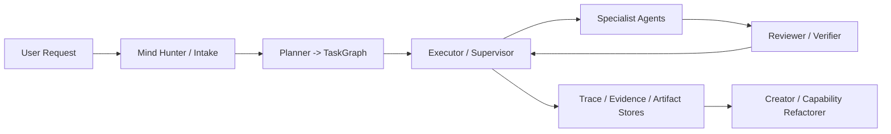

# Research System MVP

本仓库现在包含一套 Rust/Tauri 实现的分层 Research System，代码位于 [src-tauri/src/domain/research_system](/Users/dengxsh/Downloads/Work/Agent/claude-code-main/omiga/src-tauri/src/domain/research_system)。它不是玩具 demo，而是可扩展、可测试、默认离线可运行的工程骨架：Agent Cards 落盘管理、执行受 Reviewer 和 PermissionManager 约束、Runner 可在 mock 与未来 LLM provider 间切换。

## 系统目标

- 把 Intake、Planner、Executor、Specialist、Reviewer、Creator 分层。
- 用 `ContextAssembler` 控制最小上下文，减少污染。
- 用 `PermissionManager` 阻止越权工具和高风险动作绕过审批。
- 用 deterministic `MockAgentRunner`、stores、traces 和 reviewer rules 支撑离线测试。
- 允许未来接入真实 LLM provider，但默认不需要 API key。

## 架构概览



更多说明见 [docs/architecture.md](/Users/dengxsh/Downloads/Work/Agent/claude-code-main/omiga/docs/architecture.md)。

## 快速开始

Research System 通过聊天命令 `/research` 暴露：

```text
/research init
/research list-agents
/research list-proposals
/research plan 帮我检索单细胞 RNA-seq 差异分析方法，分析适用场景，生成可视化建议和报告
/research run 帮我检索单细胞 RNA-seq 差异分析方法，分析适用场景，生成可视化建议和报告
/research review-traces
/research approve-proposal proposal-id
```

后端同样保留了可测试的内部入口 [run_research_cli](/Users/dengxsh/Downloads/Work/Agent/claude-code-main/omiga/src-tauri/src/domain/research_system/cli.rs)，供 Rust 测试和后续接线复用。

`/research init` 会创建：

- `agents/`
- `.research/graphs`
- `.research/artifacts`
- `.research/evidence`
- `.research/traces`
- `.research/proposals`

## `/research` 子命令

- `init`：初始化默认 Agent Cards 与状态目录
- `list-agents`：列出当前 registry 中的有效 Agent
- `list-proposals`：列出 `.research/proposals` 中的 Creator proposals
- `plan <request>`：输出结构化 `TaskGraph`
- `run <request>`：用 `MockAgentRunner` 执行完整编排流程
- `review-traces`：让 Creator 读取 traces 并生成 `AgentPatchProposal`
- `approve-proposal <proposal_id>`：审批 proposal，并应用 `create/retire` 或输出 `split/merge` 的 `registry_patch`

## 如何新增 Agent

1. 在 `agents/` 下新增一个 Markdown 文件。
2. 文件头使用 YAML front matter，正文写 instructions。
3. 字段约定见 [docs/agent-card-spec.md](/Users/dengxsh/Downloads/Work/Agent/claude-code-main/omiga/docs/agent-card-spec.md)。
4. 通过 `/research list-agents`、`/research plan` 或 `/research run` 验证加载结果。

Registry 当前支持：

- 按 Markdown + YAML front matter 加载
- 按 `id` 获取
- 按 `category` / `capability` / `use_when` 搜索
- 版本提升与禁用
- `create` / `retire` 在显式审批后可直接写入 registry
- `split` / `merge` 在显式审批后会生成结构化 `registry_patch` 计划，供人工应用

## 运行测试

Research System 采用现有 Rust 测试栈，核心套件如下：

```bash
cargo test --manifest-path src-tauri/Cargo.toml \
  --test research_registry \
  --test research_planner \
  --test research_context_permissions \
  --test research_executor \
  --test research_reviewer_creator \
  --test research_cli
```

前端命令解析相关测试：

```bash
npm test -- workflowCommands.test.ts
```

## 关键文件

- [models.rs](/Users/dengxsh/Downloads/Work/Agent/claude-code-main/omiga/src-tauri/src/domain/research_system/models.rs)
- [intake.rs](/Users/dengxsh/Downloads/Work/Agent/claude-code-main/omiga/src-tauri/src/domain/research_system/intake.rs)
- [registry.rs](/Users/dengxsh/Downloads/Work/Agent/claude-code-main/omiga/src-tauri/src/domain/research_system/registry.rs)
- [context.rs](/Users/dengxsh/Downloads/Work/Agent/claude-code-main/omiga/src-tauri/src/domain/research_system/context.rs)
- [planner.rs](/Users/dengxsh/Downloads/Work/Agent/claude-code-main/omiga/src-tauri/src/domain/research_system/planner.rs)
- [runner.rs](/Users/dengxsh/Downloads/Work/Agent/claude-code-main/omiga/src-tauri/src/domain/research_system/runner.rs)
- [reviewer.rs](/Users/dengxsh/Downloads/Work/Agent/claude-code-main/omiga/src-tauri/src/domain/research_system/reviewer.rs)
- [executor.rs](/Users/dengxsh/Downloads/Work/Agent/claude-code-main/omiga/src-tauri/src/domain/research_system/executor.rs)
- [creator.rs](/Users/dengxsh/Downloads/Work/Agent/claude-code-main/omiga/src-tauri/src/domain/research_system/creator.rs)
- [cli.rs](/Users/dengxsh/Downloads/Work/Agent/claude-code-main/omiga/src-tauri/src/domain/research_system/cli.rs)
