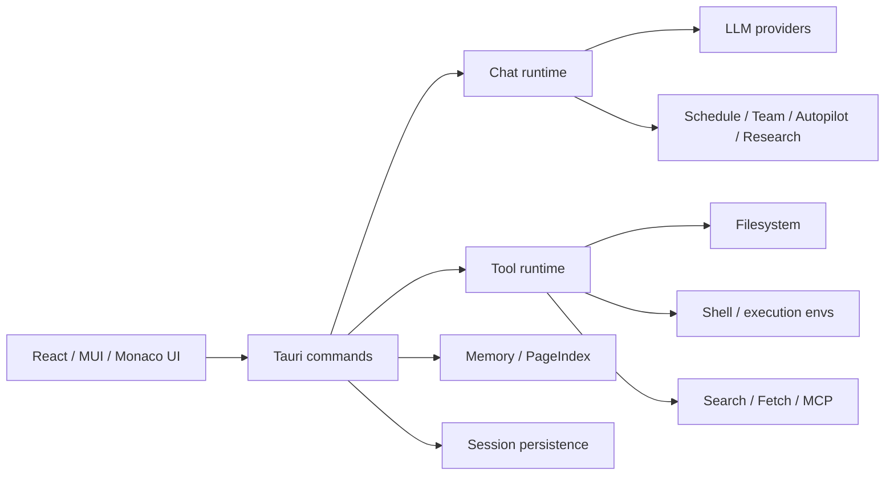

# Omiga

<p align="center">
  
</p>

<p align="center">
  <a href="https://github.com/omiga-app/omiga/releases"></a>
  
  
  
  
</p>

<p align="center">
  <a href="README.md">English</a> | <a href="README.zh-CN.md">简体中文</a>
</p>

Omiga 是一个本地优先的桌面 AI Agent 工作台，基于 **Tauri、React 和 Rust** 构建。它把聊天、仓库上下文、文件操作、终端执行、网页/搜索工具、记忆系统、定时任务和多 Agent 编排整合到一个可审计的桌面应用中。

**当前版本：** `2.0.0`

**平台支持：** macOS 是当前主要发布目标；Linux 支持从源码构建并在 CI 中验证；Windows 已配置 Tauri MSI 打包目标，但在补齐 Windows 发布验证链路前应视为实验性支持。

Omiga 面向日常任务的 AI 智能体应用，适合轻代码用户：长时间会话、代码库导航、受控工具执行、持久项目记忆，以及可检查、可验证的 Agent 工作流。

## 目录

- [核心能力](#核心能力)
- [版本亮点](#版本亮点)
- [系统要求](#系统要求)
- [快速开始](#快速开始)
- [LLM 配置](#llm-配置)
- [搜索与网页访问](#搜索与网页访问)
- [常用命令](#常用命令)
- [发布前验证](#发布前验证)
- [架构](#架构)
- [记忆系统](#记忆系统)
- [安全与隐私](#安全与隐私)
- [项目结构](#项目结构)
- [开源协议](#开源协议)
- [更多文档](#更多文档)

## 核心能力

- **桌面 AI 编程工作台**：Tauri 桌面壳 + React/MUI 界面，适合长时间工程会话。
- **Provider 化 LLM 运行时**：通过 `omiga.yaml` 或设置界面配置 DeepSeek、OpenAI、OpenAI-compatible/custom endpoint 和模型。
- **可审计工具执行**：文件读写、搜索、抓取、Shell、任务、Notebook、记忆、MCP、工作流等工具均有可见执行状态。
- **多 Agent 工作流**：支持调度、team/autopilot 风格编排、后台 Agent、research 流程和任务状态面板。
- **仓库上下文体验**：文件树、路径引用、代码预览、Monaco 编辑器、PDF/图片/HTML 渲染和工作区元数据。
- **搜索与检索**：可配置 Tavily、Exa、Firecrawl、Parallel、Google、Bing、DuckDuckGo 的优先级和回退顺序；Search 设置中也包含文献和社交来源配置入口。
- **持久记忆**：工作记忆、长期记忆、项目 Wiki、隐式偏好、来源注册表和永久用户档案。
- **执行环境配置**：支持本地执行，并提供 SSH / sandbox 相关配置界面，用于更安全、可复现的 Agent 运行。
- **发布级验证路径**：前端测试、Rust 测试、Mock LLM 编排验证、真实 LLM 验证脚本和桌面打包命令。

## 版本亮点

`2.0.0` 在 v1.0.0 工作台基础上带来质量、记忆和调度方面的全面提升：

- **BM25 字段加权记忆召回**：topic/entity/summary 分别按权重评分（3×/2×/1.5×），配合 90 天衰减的时间偏好；针对结构化查询的召回精度显著提升。
- **定时任务工具**：`CronCreate`/`CronList`/`CronDelete` 让 Agent 可调度周期性任务；**设置 → Agents → Schedule** 面板提供完整的创建/查看/删除 UI。
- **Session 文件变更追踪**：Agent 每次写入或编辑的文件实时记录，任务结束后在任务面板中展示。
- **任务执行步骤可视化**：`TaskProgressSteps` 组件实时显示工具调用链，含状态点和耗时，完成后折叠为摘要行。
- **权限对话框改进**：危险操作（bash/文件写入）在技术细节上方显示自然语言描述，如"AI 想要执行：rm -rf …"，危险操作红色背景突出显示。
- **顺序工具超时保护**：非 skill/bash/agent 工具执行上限 120 秒，防止单个慢工具阻塞整轮对话。
- **Monitor 和 PushNotification 工具**：`Monitor` 监听后台任务输出中的指定模式；`PushNotification` 在长任务完成时发送原生桌面通知。
- **Git Worktree 工具**：`EnterWorktree`/`ExitWorktree` 为 Agent 创建独立分支工作区，不影响当前检出。
- **Session 导出**：通过 Session 三点菜单将任意对话导出为 Markdown 文件。
- **测试覆盖**：844 个 Rust 测试，307 个前端单元测试。

## 系统要求

- **Bun** 1.x（本仓库的标准 JavaScript 包管理器）
- **Rust** 1.75+
- 当前操作系统所需的 **Tauri 2** 依赖
- **macOS 11+**：当前主要发布路径
- **Linux**：需安装 Tauri 所需 WebKit/GTK 包，支持源码构建并通过 CI 验证
- **Windows**：已配置 MSI 打包目标，但当前发布验证仍属于实验性
- 至少一个支持的 LLM Provider key，或一个 OpenAI-compatible 本地 endpoint，用于真实 Agent 运行

> 本仓库使用 Bun 安装依赖和运行脚本。不要使用 `npm install`。

## 快速开始

```bash
# 1. 安装 JavaScript 依赖
bun install

# 2. 创建本地运行配置
cp config.example.yaml omiga.yaml

# 3. 配置至少一个真实 Provider key，例如
export DEEPSEEK_API_KEY="sk-..."
# 或
export OPENAI_API_KEY="sk-..."

# 4. 启动桌面开发应用
bun run tauri dev
```

仅启动前端开发服务：

```bash
bun run dev
```

构建前端：

```bash
bun run build
```

构建桌面应用包：

```bash
bun run tauri build
```

## LLM 配置

从模板开始：

```bash
cp config.example.yaml omiga.yaml
```

示例：

```yaml
version: "1.0"
default: "deepseek"

providers:
  deepseek:
    type: deepseek
    api_key: ${DEEPSEEK_API_KEY}
    model: deepseek-chat
    enabled: true

  openai:
    type: openai
    api_key: ${OPENAI_API_KEY}
    model: gpt-4o
    enabled: false

  custom:
    type: custom
    api_key: ${LLM_API_KEY}
    base_url: ${LLM_BASE_URL}
    model: ${LLM_MODEL}
    enabled: false

settings:
  max_tokens: 4096
  temperature: 0.7
  timeout: 600
  enable_tools: true
  web_use_proxy: true
  web_search_engine: ddg
  web_search_methods: [tavily, exa, firecrawl, parallel, google, bing, ddg]
```

配置查找顺序：

1. 项目根目录：`omiga.yaml`、`omiga.yml`、`omiga.json` 或 `omiga.toml`
2. 从 `src-tauri` 启动时的父项目根目录
3. 用户配置目录：`~/.config/omiga/omiga.yaml` 及相关扩展名
4. 兼容旧版 Omiga home：`~/.omiga/omiga.yaml` 及相关扩展名

不要提交真实 API key。建议使用环境变量或用户级私有配置文件。

## 搜索与网页访问

Omiga 在 **设置 → Search** 中集中管理搜索和抓取相关配置。

网页搜索方式支持排序和启用/禁用。运行时会严格按用户设置的优先级依次尝试；每种方式最多尝试三次，如果失败或没有可用结果，则自动尝试下一种方式。

支持的网页搜索方式：

- Tavily
- Exa
- Firecrawl
- Parallel
- Google
- Bing
- DuckDuckGo

Search 设置中还包含文献检索相关配置，例如 PubMed / Semantic Scholar；在当前构建支持时，也包含微信公众号等社交来源搜索选项。

代理开关同样在 **设置 → Search** 中配置。网络环境需要系统或环境代理时保持开启；需要强制直连时关闭。

## 常用命令

| 目标 | 命令 |
| --- | --- |
| 安装依赖 | `bun install` |
| 前端开发服务 | `bun run dev` |
| Tauri 桌面开发应用 | `bun run tauri dev` |
| 前端测试 | `bun run test` |
| 前端生产构建 | `bun run build` |
| 桌面应用打包 | `bun run tauri build` |
| Rust 测试 | `cargo test --manifest-path src-tauri/Cargo.toml` |
| Rust 格式化检查 | `cargo fmt --manifest-path src-tauri/Cargo.toml --all -- --check` |
| Rust lint | `cargo clippy --manifest-path src-tauri/Cargo.toml --all-targets -- -D warnings` |
| Mock LLM 验证 | `./scripts/mock-llm-validation.sh all` |
| 真实 LLM 验证 | `./scripts/real-llm-validation.sh all` |

## 发布前验证

打 tag 或分发桌面构建前，建议执行：

```bash
bun install
bun run test
bun run build
cargo fmt --manifest-path src-tauri/Cargo.toml --all -- --check
cargo clippy --manifest-path src-tauri/Cargo.toml --all-targets -- -D warnings
cargo test --manifest-path src-tauri/Cargo.toml
./scripts/mock-llm-validation.sh all
bun run tauri build
```

真实 Provider 验证需要先配置有效凭据：

```bash
./scripts/real-llm-validation.sh smoke
./scripts/real-llm-validation.sh all
```

桌面应用手动 smoke test：

1. 启动打包后的应用。
2. 创建或打开会话。
3. 选择工作区。
4. 配置 Provider 和模型。
5. 发送普通聊天请求。
6. 执行一次文件、搜索或工具任务。
7. 取消一个运行中的任务，并确认 UI 能恢复。
8. 确认 Provider、Search、权限、记忆和执行环境设置能够持久化。
9. 确认日志和错误信息足够用于诊断问题。

## 架构



主要分层：

- **前端 (`src/`)**：聊天 UI、设置、文件树、任务状态、渲染器、可视化和状态管理。
- **Tauri 命令边界 (`src-tauri/src/commands/`)**：会话、设置、工具、记忆和编排相关 IPC 入口。
- **领域运行时 (`src-tauri/src/domain/`)**：工具、Agent、记忆、权限、搜索、Research System、路由和运行约束。
- **LLM 层 (`src-tauri/src/llm/`)**：Provider 配置加载、模型客户端、流式响应和 Provider 特定行为。
- **持久化**：会话、消息、编排事件、记忆条目、来源注册表和研究产物。

## 记忆系统

Omiga 内置多层记忆模型：

| 层级 | 用途 |
| --- | --- |
| 工作记忆 | 当前会话任务上下文和活动决策 |
| 长期记忆 | 持久洞察、规则、摘要和带来源事实 |
| 项目 Wiki | 可检索的结构化项目知识 |
| 隐式记忆 | 观察到的用户/项目偏好 |
| 永久档案 | 跨项目用户档案和长期偏好 |
| 来源注册表 | 规范化网页/资料来源和可复用摘要 |

可以在 **设置 → Memory** 中查看和管理记忆。应用会把相关记忆注入 Agent 提示，同时保留显式管理能力给用户。

## 安全与隐私

- Omiga 是本地优先应用。会话、记忆和研究产物默认保存在本机，除非你配置外部服务。
- LLM 调用会把选中的会话上下文和工具输出发送给你配置的 Provider。请根据隐私和合规要求选择 Provider。
- 工具执行可以在权限与配置允许时读取文件、写入文件、运行 shell 命令并访问网络/搜索 Provider。
- 不要把 API key 放进 git。使用环境变量或私有配置文件。
- 在敏感仓库上运行 Agent 工作流前，请先检查权限设置。
- 生成代码和工具输出在审查、测试前都应视为未受信任。

## 项目结构

```text
.
├── src/                         # React 前端
│   ├── components/              # Chat、设置、文件树、任务状态、渲染器
│   ├── state/                   # Zustand store 和会话/活动状态
│   ├── hooks/                   # UI / runtime hooks
│   ├── lib/                     # Monaco/PDF workers 与共享 helper
│   └── utils/                   # 前端工具函数和测试
├── src-tauri/                   # Rust/Tauri 后端
│   ├── src/commands/            # Tauri IPC 命令
│   ├── src/domain/              # 工具、Agent、记忆、搜索、权限、研究系统
│   ├── src/llm/                 # Provider 客户端和配置加载
│   └── tests/                   # Rust 集成测试
├── docs/                        # 架构、验证和实现说明
├── scripts/                     # 验证与开发辅助脚本
├── config.example.yaml          # 运行配置模板
├── package.json                 # Bun 脚本和前端依赖
└── vite.config.ts               # Vite 构建 / chunk 配置
```

## 开源协议

Omiga 使用 [MIT License](LICENSE) 发布。

## 更多文档

- [`docs/architecture.md`](docs/architecture.md)
- [`docs/FEATURE_STATUS.md`](docs/FEATURE_STATUS.md)
- [`docs/SECURITY_MODEL.md`](docs/SECURITY_MODEL.md)
- [`docs/REAL_LLM_VALIDATION.md`](docs/REAL_LLM_VALIDATION.md)
- [`docs/MOCK_LLM_RUNTIME_VALIDATION.md`](docs/MOCK_LLM_RUNTIME_VALIDATION.md)
- [`docs/agent-card-spec.md`](docs/agent-card-spec.md)
- [`docs/unified-memory-design.md`](docs/unified-memory-design.md)
