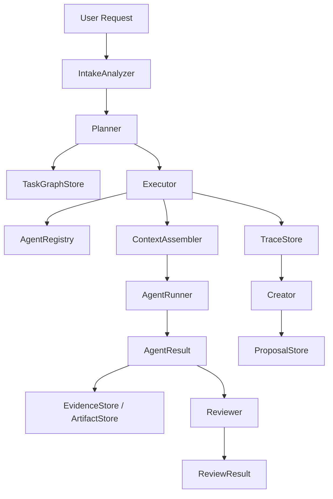

# Research System Architecture

## 分层说明

### 1. Mind Hunter / Intake

- 负责理解请求、暴露 assumptions、记录 ambiguities、评估复杂度。
- 输出 `IntakeAssessment`，包含 `execution_route: solo | workflow | multi_agent`。
- 不直接执行任务，也不静默替用户拍板高歧义解释。

### 2. Planner

- 负责把 `user_request + IntakeAssessment` 转成 `TaskGraph`。
- 每个 `TaskSpec` 都必须带：
  - `success_criteria`
  - `verification`
  - `failure_conditions`
  - `stop_conditions`
  - `budget`
- 当前是 deterministic heuristic planner，后续可替换为 provider-backed planner。

### 3. Executor / Supervisor

- 只做调度和监督，不重写用户目标。
- 按 dependencies 选择可执行 task。
- 从 registry 取 `AgentCard`，通过 `ContextAssembler` 组最小上下文。
- 经过 `PermissionManager` 检查后再调用 `AgentRunner`。
- 写入 results / artifacts / evidence / traces，并在每个 task 后强制跑 Reviewer。

### 4. Specialist Agents

默认 Agent Cards：

- `mind_hunter.intake`
- `planner.task_graph`
- `executor.supervisor`
- `seeker.web_research`
- `processor.data`
- `analyzer.data`
- `algorithm.method`
- `programmer.code`
- `debugger.error`
- `painter.visualization`
- `reporter.final`
- `biologist.domain`
- `reviewer.verifier`
- `creator.capability_refactorer`

约束：

- specialist 默认不创建子 Agent
- 不实现无限递归
- 统一走 `AgentRunner` 接口

### 5. Reviewer / Verifier

- 规则化检查 `AgentResult` 是否满足 `TaskSpec`
- 当前 checks 包括：
  - 必需字段
  - 输出 shape
  - evidence refs
  - success criteria coverage
  - permission state
  - tool call budget
  - consistency statement
- 输出 `pass | revise | fail`

### 6. Creator / Capability Refactorer

- 读取 `TraceStore`
- 检测重复失败、重复 revise、重复任务模式
- 输出 `AgentPatchProposal`
- 不直接改生产 registry
- 只有显式审批后，`create` / `retire` 才可通过 registry store 落盘
- `split` / `merge` 在显式审批后会产出结构化 `registry_patch`，但仍需人工应用

## 数据流

## 上下文隔离策略

`ContextAssembler` 当前支持并受 `AgentCard.context_policy` 控制的上下文片段：

- `global_context`
- `user_goal`
- `assumptions`
- `global_constraints`
- `task_spec`
- `task_context`
- `upstream_results_summary`
- `prior_evidence_summary`
- `evidence_refs`
- `artifact_refs`
- `agent_instructions`

默认不会注入：

- 完整对话历史
- 无关 agent logs
- 其他 agent 的 scratchpad
- 原始工具输出 dump

## 权限模型

`PermissionManager` 是 Executor 必经 gate：

1. `requested_tools` 必须属于 `AgentCard.tools.allowed`
2. `requested_tools` 不能命中 `AgentCard.tools.forbidden`
3. `requested_permissions` 必须是 `AgentCard.permissions` 的子集
4. 若 action 需要人工审批，则返回 `requires_approval`

Executor 不会绕过权限检查，也不会把需要审批的任务静默执行。

## Creator 的 create / split / merge / retire 流程

1. 扫描 traces
2. 聚合失败、revise、重复 goal family
3. 生成 proposal，至少包含：
  - `reason`
  - `expected_benefit`
  - `eval_plan`
  - `rollback_plan`
4. proposal 写入 `ProposalStore`
5. 等待显式审批
6. `create` / `retire` 在审批后可自动落到 registry store
7. `split` / `merge` 在审批后生成 `registry_patch`
8. 人工根据 patch 中的 draft cards、routing steps 和 disable steps 执行迁移
9. `/research approve-proposal <proposal_id>` 是当前用户可用的审批入口

## 当前 MVP 边界

- planner 仍是 heuristic
- mock runner 默认离线
- reviewer 仍是 rule-based
- creator 的 `split` / `merge` 仍是人工 apply
- `/research` 是唯一公开入口
